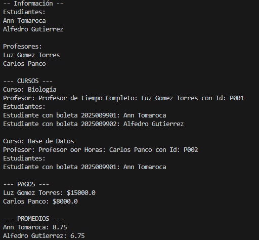

# Práctica 8: Sistema de Gestión de Cursos Académicos Multilenguaje
## Objetivo del Proyecto
El objetivo de este sistema es crear una plataforma simple que permita:

	•Registrar profesores (de tiempo completo y por horas)
 
	•Registrar estudiantes con sus calificaciones
 
	•Asociar estudiantes y profesores a cursos
 
	•Calcular promedios de estudiantes y pagos de profesores
 
	•Mostrar información estructurada del curso, profesores y estudiantes

El objetivo principal del proyecto es desarrollar un sistema académico modular y escalable que a través de una arquitectura orientada a objetos. Este sistema se ha implementado en dos lenguajes de programación: Java y Python, con el propósito de mostrar cómo se puede mantener la lógica y diseño en múltiples plataformas de desarrollo.

## Características Comunes del Sistema
| Elemento                | Descripción                                                                   |
|-------------------------|--------------------------------------------------------------------------------|
| Entidad Persona         | Clase base abstracta para Estudiante y Profesor                                |
| Profesor por horas / tiempo | Calcula pago de manera diferente según su tipo                           |
| Estudiante              | Tiene nombre, ID, calificaciones y puede calcular su promedio                 |
| Curso                   | Se asocia a un profesor y a múltiples estudiantes                              |
| Interfaces (Java)       | `Pagable` para profesores y `Calificable` para estudiantes                     |
| Excepciones personalizadas | Para errores de pago o de promedio no calculable                         |
| Consola interactiva     | Menú paso a paso para registrar información y mostrar resultados               |

## Versión en Java
Este proyecto pone en práctica conceptos clave de Programación Orientada a Objetos en Java: abstracción, herencia, interfaces, polimorfismo, excepciones personalizadas y colecciones (List, ArrayList).

**Estructura de Archivos**
/SistemaCursosJava

│
├── Main.java

├── MainConScannerDatos.java

├── Curso.java

├── Persona.java

├── Estudiante.java

├── ProfesorPorHoras.java

├── ProfesorTiempoCompleto.java

│

├── interfaces/

│   ├── Pagable.java

│   └── Calificable.java

│

└── excepciones/

    ├── PagoInvalidoException.java
    
    └── PromedioInvalidoException.java
   
**Elementos Clave** 

	•Interfaces: Pagable, Calificable
 
	•Excepciones: PagoInvalidoException, PromedioInvalidoException
 
	•POO: Uso fuerte de encapsulamiento, herencia, abstracción y polimorfismo
 
	•Listas: ArrayList

**Instrucciones de Compilación**

javac */*.java *.java

java MainConScannerDatos

## Versión en Python
## Elementos Clave

	•	Clases Base: Persona (abstracta con mostrar_info())
 
	•	Interfaces Simuladas: Se implementan como métodos comunes (calcular_pago, calcular_promedio)
 
	•	Excepciones Personalizadas: 
 class PagoInvalidoException(Exception): pass
 
 class PromedioInvalidoException(Exception): pass	
 
       •	Listas Dinámicas: Uso de list
 ## Instrucciones de Ejecución
 
 	1.	Guarda los archivos en la misma carpeta.
  
	2.	Ejecuta: python main.py
 ## Comparación Java vs Python
 | Característica         | Java                                      | Python                                       |
|------------------------|-------------------------------------------|----------------------------------------------|
| Abstracción            | Clases abstractas + interfaces            | Métodos en clases base y polimorfismo implícito |
| Excepciones            | Personalizadas (`extends Exception`)      | Personalizadas (`class MiError(Exception)`)  |
| Listas                 | `ArrayList` con tipo                      | `list` dinámico                              |
| Entrada por consola    | `Scanner`                                 | `input()`                                    |
| Compilación            | Requiere compilación previa               | Interpretado directamente                    |
| Verbosidad             | Alta (tipado estricto)                    | Baja (más conciso)                           |
| POO                    | Obligatoria y explícita                   | Flexible y más natural                       |

## Capturas
  
